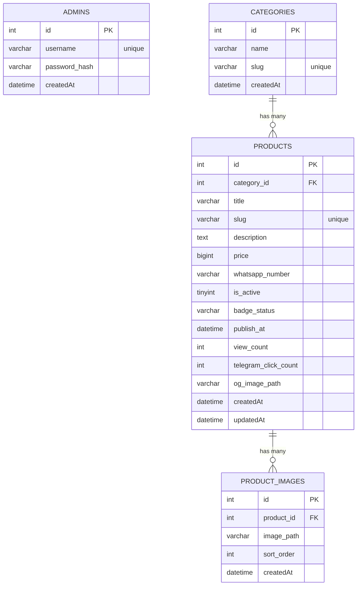

# JeStore — Product Requirements Document

## 0. Metadata

* **Project:** JeStore — Katalog Produk Digital + Admin Panel
* **Owner:** Je Store
* **Priority:** **Mobile-first** (max-width 480px, desktop tetap rapi)
* **Deploy:** cPanel shared hosting (PHP + MySQL)
* **Runtime:** PHP 8.1+, MySQL 5.7+ / MariaDB 10+
* **Frontend:** Tailwind CSS (compiled) + Vanilla JS

---

## 1. Objective

Website katalog produk digital dengan:

* Listing produk ringan, cepat, mobile-friendly
* Foto produk portrait (screenshot HP, 9:16)
* Checkout langsung via **Telegram** (prefilled message)
* Admin panel untuk CRUD produk, kategori, multi-image upload
* Analytics sederhana (views, klik Telegram, CTR)
* Deploy tanpa Node.js — PHP murni, cocok shared hosting cPanel

---

## 2. Scope

### 2.1 Public (User)

**Pages**

1. **Home** — hero section + kategori + produk terbaru
2. **Katalog** — search, filter kategori, sort, pagination
3. **Detail Produk** — carousel gambar, deskripsi, produk serupa, CTA order
4. **Kategori shortlink** (`/c/slug` → redirect ke katalog filtered)

**User Flow**

User buka homepage → scroll produk → klik produk → lihat galeri gambar portrait → klik **"Order Sekarang via Telegram"** → redirect ke Telegram dengan pesan prefilled.

### 2.2 Admin Panel

**Pages**

1. **Login**
2. **Dashboard** — statistik produk, views, klik TG, CTR, top produk
3. **Produk** — list + toggle aktif + edit + hapus
4. **Tambah/Edit Produk** — form + multi image upload
5. **Kategori** — CRUD inline

**Admin Flow**

Admin login → tambah/edit produk → upload gambar (max 10) → set badge/jadwal publish → simpan.

---

## 3. Requirements

### 3.1 Functional

| ID | Requirement |
|----|-------------|
| FR-01 | Katalog menampilkan produk aktif (`is_active=1`) yang sudah publish |
| FR-02 | Produk punya `title, description, category, images[], badge_status` |
| FR-03 | Detail produk: carousel gambar, lightbox fullscreen, deskripsi, produk serupa |
| FR-04 | CTA sticky "Order via Telegram" dengan prefilled message |
| FR-05 | Admin upload **multiple images** (min 1, max 10, JPG/PNG/WEBP, max 2MB/file) |
| FR-06 | Admin CRUD kategori (nama + auto slug) |
| FR-07 | Admin toggle produk aktif/nonaktif |
| FR-08 | Admin set badge (Hot/Ready/Limited/New/None) + jadwal publish |
| FR-09 | Tracking: view count + klik Telegram per produk |
| FR-10 | Search produk by title, filter by kategori, sort newest/oldest |
| FR-11 | Slug URL untuk produk & kategori |
| FR-12 | Auth admin: session-based + password hashed (bcrypt via `password_hash()`) |
| FR-13 | Produk serupa otomatis (keyword matching + same category) |

### 3.2 Non-Functional

| ID | Requirement |
|----|-------------|
| NFR-01 | LCP cepat, lazy-load images, ringan di mobile |
| NFR-02 | Upload: validasi MIME type, size limit, sanitize filename |
| NFR-03 | SEO: title, meta description, Open Graph, canonical URL |
| NFR-04 | Mobile-first: nyaman di 360–480px |
| NFR-05 | Prepared statements (PDO), XSS escape, session-based auth |

---

## 4. Tech Stack

### 4.1 Backend

* PHP 8.1+ (native, tanpa framework)
* PDO MySQL (prepared statements)
* `password_hash()` / `password_verify()` (bcrypt)
* Session-based auth (cookie `PHPSESSID`)
* `finfo` untuk validasi MIME upload
* `.env` file parser custom (tanpa dependency eksternal)

### 4.2 Frontend

* Tailwind CSS (pre-compiled ke `app.css`)
* Vanilla JS (`app.js`) — carousel, lightbox, ripple, live search, confirm delete
* Google Fonts: Plus Jakarta Sans + Clash Display

### 4.3 Server

* Apache + mod_rewrite (`.htaccess`)
* Front controller pattern (`public_html/index.php`)
* cPanel shared hosting

---

## 5. Folder Structure

```
php-app/
├── .env                        # environment config (di luar web root)
├── app/
│   ├── auth.php                # admin auth functions
│   ├── config.php              # load env + app config
│   ├── db.php                  # PDO connection singleton
│   ├── env.php                 # .env parser
│   ├── helpers.php             # utility functions, slug, icon SVG, etc.
│   ├── repo.php                # all database queries + business logic
│   └── views/
│       ├── admin_layout.php    # admin layout wrapper
│       ├── public_layout.php   # public layout wrapper (SEO, OG, nav)
│       ├── admin/
│       │   ├── categories.php
│       │   ├── dashboard.php
│       │   ├── login.php
│       │   ├── product_form.php
│       │   └── products.php
│       └── public/
│           ├── catalog.php
│           ├── detail.php
│           ├── error.php
│           └── home.php
└── public_html/                # document root (cPanel)
    ├── .htaccess               # rewrite rules
    ├── index.php               # front controller (all routes)
    ├── css/
    │   └── app.css             # compiled Tailwind
    ├── js/
    │   └── app.js              # vanilla JS
    └── uploads/
        ├── og/                 # OG images
        └── products/           # product images
```

---

## 6. Database Schema

### 6.1 Tables

#### `admins`

| Column | Type | Notes |
|--------|------|-------|
| id | INT UNSIGNED PK AUTO_INCREMENT | |
| username | VARCHAR(100) UNIQUE | |
| password_hash | VARCHAR(255) | bcrypt |
| createdAt | DATETIME | |

#### `categories`

| Column | Type | Notes |
|--------|------|-------|
| id | INT UNSIGNED PK AUTO_INCREMENT | |
| name | VARCHAR(120) | |
| slug | VARCHAR(140) UNIQUE | auto-generated |
| createdAt | DATETIME | |

#### `products`

| Column | Type | Notes |
|--------|------|-------|
| id | INT UNSIGNED PK AUTO_INCREMENT | |
| category_id | INT UNSIGNED FK → categories.id | |
| title | VARCHAR(180) | |
| slug | VARCHAR(220) UNIQUE | auto-generated |
| description | TEXT | nullable |
| price | BIGINT UNSIGNED | default 0 |
| whatsapp_number | VARCHAR(30) | Telegram link/username |
| is_active | TINYINT(1) | default 1 |
| badge_status | VARCHAR(20) | none/hot/ready/limited/new |
| publish_at | DATETIME | nullable, scheduled publish |
| view_count | INT UNSIGNED | default 0 |
| telegram_click_count | INT UNSIGNED | default 0 |
| og_image_path | VARCHAR(255) | nullable |
| createdAt | DATETIME | |
| updatedAt | DATETIME | |

#### `product_images`

| Column | Type | Notes |
|--------|------|-------|
| id | INT UNSIGNED PK AUTO_INCREMENT | |
| product_id | INT UNSIGNED FK → products.id ON DELETE CASCADE | |
| image_path | VARCHAR(255) | relative path |
| sort_order | INT UNSIGNED | default 0 |
| createdAt | DATETIME | |

### 6.2 ERD (Mermaid)



---

## 7. Routes

### Public

| Method | Path | Description |
|--------|------|-------------|
| GET | `/` | Homepage (hero + kategori + produk terbaru) |
| GET | `/katalog` | Katalog + search/filter/sort/pagination |
| GET | `/c/:slug` | Redirect ke katalog filtered by category |
| GET | `/p/:slug` | Detail produk + increment view |
| GET | `/go/tg/:slug` | Track klik Telegram + redirect |

### Admin

| Method | Path | Description |
|--------|------|-------------|
| GET | `/admin/login` | Form login |
| POST | `/admin/login` | Process login |
| POST | `/admin/logout` | Logout |
| GET | `/admin` | Dashboard |
| GET | `/admin/products` | List produk |
| GET | `/admin/products/new` | Form tambah produk |
| POST | `/admin/products` | Simpan produk baru |
| GET | `/admin/products/:id/edit` | Form edit produk |
| POST | `/admin/products/:id` | Update produk |
| POST | `/admin/products/:id/delete` | Hapus produk |
| POST | `/admin/products/:id/toggle` | Toggle aktif/nonaktif |
| GET | `/admin/categories` | List + form kategori |
| POST | `/admin/categories` | Tambah kategori |
| POST | `/admin/categories/:id` | Update kategori |
| POST | `/admin/categories/:id/delete` | Hapus kategori |

---

## 8. UI/UX Design System

### 8.1 Layout

* Container: `max-w-[480px] mx-auto` (mobile-feel)
* Desktop: centered, tidak melebar
* Product image: portrait 9:16, `object-contain` (tidak di-crop)

### 8.2 Theme (Dark Modern)

* Background: `bg-slate-950`
* Card: `bg-slate-900 border border-white/10 rounded-2xl`
* Text primary: `text-slate-100`
* Text muted: `text-slate-300`
* CTA: `bg-emerald-500 hover:bg-emerald-400 text-black`
* Accent: `text-emerald-300` / `text-cyan-300`

### 8.3 Components

* **Product Card** — image 9:16, title, Detail + TG buttons
* **Badge Chip** — Hot (red), Ready (green), Limited (amber), New (blue)
* **Carousel** — swipe + prev/next buttons + thumbnail grid
* **Lightbox** — fullscreen image viewer
* **CTA Dock** — sticky bottom bar "Order via Telegram"
* **Bottom Nav** — Beranda / Katalog / Admin (3 tabs)
* **Admin Cards** — stat cards, product list cards, inline category forms

### 8.4 Typography

* Title: Plus Jakarta Sans 600/700
* Display: Clash Display 600/700
* Body: `text-sm` (14px)

---

## 9. Image Upload

* Field: `images[]` (multi-file)
* Max: 10 files per produk
* Max size: 2MB per file
* Allowed: `image/jpeg`, `image/png`, `image/webp`
* Validasi: `finfo` MIME check
* Naming: `{slug}-{timestamp}-{index}.{ext}`
* Storage: `public_html/uploads/products/`
* Sort order: auto berdasarkan urutan upload

---

## 10. Deploy (cPanel PHP)

1. Upload `php-app/` ke server
2. Set document root ke `php-app/public_html/`
3. Buat `.env` di `php-app/` dengan kredensial DB
4. Buat database + jalankan schema SQL
5. Buka `/seed-admin.php` untuk buat admin → hapus file setelah selesai
6. Set permission `755` pada folder `public_html/uploads/`
7. Pastikan `mod_rewrite` aktif

---

## 11. Acceptance Criteria

- [ ] Homepage menampilkan kategori + produk terbaru
- [ ] Katalog: search, filter kategori, sort, pagination berfungsi
- [ ] Detail produk: carousel swipe, lightbox, deskripsi, produk serupa
- [ ] CTA "Order via Telegram" redirect dengan pesan yang benar
- [ ] Admin login/logout berfungsi
- [ ] Admin CRUD produk + multi image upload
- [ ] Admin CRUD kategori
- [ ] Toggle aktif/nonaktif produk
- [ ] Badge + scheduled publish berfungsi
- [ ] View count + klik Telegram tracking
- [ ] Dashboard analytics menampilkan data yang benar
- [ ] Deploy di cPanel tanpa error
- [ ] Mobile responsive (360–480px)
- [ ] Cache busting pada CSS/JS assets
