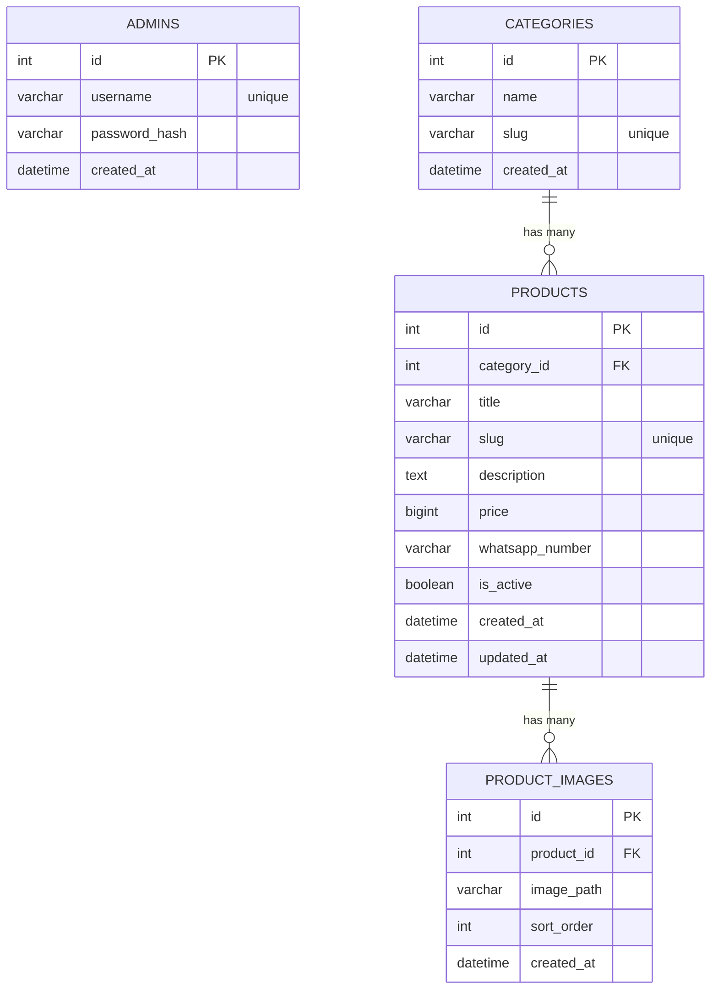

Berikut **PRD ulang (AI Codex–friendly)** + **Tailwind UI Design System** + **ERD Diagram** (pakai Mermaid, jadi Codex bisa langsung generate DB & relasi).

---

# `prd.md`

## 0. Metadata

* **Project:** Store Website + Admin Panel (Clone style `store.lazacloud.my.id`)
* **Owner:** Je Store
* **Priority:** **Mobile-first** (desktop tetap bagus tapi secondary)
* **Deploy Target:** cPanel (NodeJS App) + MySQL lokal (phpMyAdmin)
* **Runtime:** Node.js 18+ (php81/php82 tidak jadi constraint karena app Node)

---

## 1. Objective

Membangun website katalog produk + admin panel (mirip referensi) dengan:

* Listing produk cepat, ringan, mobile-friendly
* Produk pakai **foto portrait** (lebih ideal “screenshot HP” 9:16)
* Admin panel untuk:

  * Login
  * CRUD produk
  * Upload **lebih dari 1 foto** per produk (multi-image)
  * Manage kategori
  * Toggle produk aktif/nonaktif
* Performa cepat (local MySQL, caching header, gambar terkompresi)

---

## 2. Scope

### 2.1 Public (User)

**Pages**

1. Home / Catalog (list produk)
2. Product Detail
3. Category Page (opsional tapi direkomendasikan)
4. Search (opsional v1.0, tapi bagus kalau ada)

**User Flow**

* User buka homepage → scroll list produk → klik produk → lihat slider gambar → klik “Beli via WhatsApp” → redirect WA dengan prefilled message.

### 2.2 Admin Panel

**Pages**

1. Login
2. Dashboard (stat sederhana: jumlah produk, kategori)
3. Products list (table + actions)
4. Add product
5. Edit product
6. Manage categories

**Admin Flow**

* Admin login → add/edit produk → upload multi images → set harga, deskripsi → publish (is_active=true).

---

## 3. Requirements

### 3.1 Functional Requirements

**FR-01** Catalog menampilkan produk aktif (`is_active=true`)
**FR-02** Produk memiliki `title, price, description, category, images[]`
**FR-03** Product detail menampilkan:

* Slider/carousel gambar (swipe support)
* Deskripsi
* Harga
* Tombol sticky “Beli Sekarang (WA)”

**FR-04** Admin bisa upload **multiple images** per product

* Min: 1 image
* Max: 10 images (configurable)

**FR-05** Admin bisa reorder images (v1 nice-to-have)

* Minimal: set `sort_order` otomatis berdasarkan urutan upload
* Advanced: drag & drop reorder

**FR-06** Admin CRUD kategori
**FR-07** Slug URL untuk produk & kategori
**FR-08** Auth admin (JWT/cookie session) + password hashed (bcrypt)

### 3.2 Non-Functional Requirements

* **NFR-01 Performance:** LCP cepat, list page ringan, lazy-load images
* **NFR-02 Upload Security:** validasi mime type, size limit, sanitize filename
* **NFR-03 Image Optimization:** simpan WEBP jika bisa + auto resize max width 1080
* **NFR-04 SEO Basic:** title/meta OG minimal
* **NFR-05 Mobile-first:** tampilan nyaman di 360–480px

---

## 4. UI/UX (Mobile First)

### 4.1 Mobile Layout Rules

* Container max width: `max-w-[480px]` (mobile feel)
* Desktop: center container, jangan jadi “lebar banget”
* Produk image: portrait (9:16), full card width

### 4.2 Product Image Rules (Screenshot-style)

* Aspect ratio **9:16**
* CSS: `aspect-[9/16] object-cover`
* Gunakan thumbnail yang tetap portrait

### 4.3 Components

* Product Card
* Product Image Carousel
* Sticky Buy Bar (di bawah)
* Admin Table
* Admin Form (input + textarea + upload)

---

## 5. Tech Stack (NodeJS Modern, cocok cPanel)

### 5.1 Backend

* Node.js 18+
* Express.js
* MySQL
* Sequelize ORM (recommended)
* Multer (upload)
* Sharp (image resize/compress) — recommended
* bcrypt (password)
* Auth: JWT in HttpOnly cookie (recommended)

### 5.2 Frontend

**Recommended untuk cPanel stable:**

* EJS templates + TailwindCSS
* Vanilla JS untuk carousel/slider ringan

(Next.js bisa juga, tapi untuk cPanel kadang lebih ribet; PRD ini fokus opsi paling deploy-friendly.)

---

## 6. Folder Structure (Codex-friendly)

```txt
lazastore/
├── app.js
├── package.json
├── .env.example
├── tailwind.config.js
├── postcss.config.js
│
├── src/
│   ├── config/
│   │   ├── database.js
│   │   └── env.js
│   │
│   ├── models/
│   │   ├── Admin.js
│   │   ├── Category.js
│   │   ├── Product.js
│   │   └── ProductImage.js
│   │
│   ├── controllers/
│   │   ├── auth.controller.js
│   │   ├── admin.controller.js
│   │   ├── product.controller.js
│   │   └── category.controller.js
│   │
│   ├── routes/
│   │   ├── public.routes.js
│   │   ├── admin.routes.js
│   │   └── api.routes.js
│   │
│   ├── middleware/
│   │   ├── requireAdmin.js
│   │   ├── uploadImages.js
│   │   └── errorHandler.js
│   │
│   ├── services/
│   │   ├── image.service.js
│   │   └── whatsapp.service.js
│   │
│   ├── views/
│   │   ├── layouts/
│   │   │   ├── public.ejs
│   │   │   └── admin.ejs
│   │   ├── public/
│   │   │   ├── home.ejs
│   │   │   └── product-detail.ejs
│   │   └── admin/
│   │       ├── login.ejs
│   │       ├── dashboard.ejs
│   │       ├── products.ejs
│   │       ├── product-form.ejs
│   │       └── categories.ejs
│   │
│   └── public/
│       ├── assets/
│       ├── css/
│       │   └── app.css
│       ├── js/
│       │   └── app.js
│       └── uploads/
│           └── products/
│
└── scripts/
    ├── seed-admin.js
    └── migrate.js
```

---

## 7. Database Schema

### 7.1 Tables

#### `admins`

* id (PK)
* username (unique)
* password_hash
* created_at

#### `categories`

* id (PK)
* name
* slug (unique)
* created_at

#### `products`

* id (PK)
* category_id (FK → categories.id)
* title
* slug (unique)
* description
* price (BIGINT)
* whatsapp_number (string, optional global default juga boleh)
* is_active (boolean)
* created_at
* updated_at

#### `product_images`

* id (PK)
* product_id (FK → products.id)
* image_path (string)
* sort_order (int)
* created_at

---

## 8. ERD Diagram (Mermaid)

> Codex bisa langsung pakai ini buat generate migration.



---

## 9. Image Upload Requirements (Multi Image = YES)

* Endpoint admin: `POST /admin/products` + `PUT /admin/products/:id`
* Field upload: `images[]`
* Max files: 10
* Max size per file: 2MB (config)
* Allowed mime: jpg, png, webp
* Storage: `src/public/uploads/products/`
* Naming: `{productSlug}-{timestamp}-{index}.webp`
* After upload:

  * Resize max width 1080px
  * Convert webp quality 80 (recommended)
  * Generate thumbnail (optional v1.1)

---

## 10. Tailwind UI Design System

### 10.1 Design Goals

* Clean
* Mobile-first
* Fokus gambar portrait
* CTA jelas (“Beli Sekarang”)

### 10.2 Tokens (gunakan Tailwind default + extend)

#### Colors (recommend)

* Background: `slate-950` (dark) / atau `white` (light) — pilih salah satu style, jangan campur
* Card: `slate-900` (dark) / `white` (light)
* Text: `slate-100` (dark) / `slate-900` (light)
* Accent/CTA: `emerald-500` (atau `blue-500`)

**Rekomendasi theme: dark modern (mirip store style banyak)**

* bg: `bg-slate-950`
* card: `bg-slate-900`
* border: `border-white/10`
* text: `text-slate-100`
* muted: `text-slate-300`
* CTA: `bg-emerald-500 hover:bg-emerald-400 text-black`

#### Typography

* Title: `text-base font-semibold leading-snug`
* Price: `text-lg font-bold`
* Body: `text-sm text-slate-300 leading-relaxed`
* Button: `text-sm font-semibold`

#### Radius & Shadow

* Card radius: `rounded-2xl`
* Images radius: `rounded-xl`
* Shadow: `shadow-lg shadow-black/20`

#### Spacing

* Page padding: `px-4 py-4`
* Card gap: `gap-3`
* Section spacing: `space-y-4`

### 10.3 Base Layout Classes

**Mobile container**

* `mx-auto max-w-[480px] px-4`

**Card**

* `rounded-2xl bg-slate-900 border border-white/10 shadow-lg shadow-black/20 overflow-hidden`

**Product image wrapper**

* `aspect-[9/16] w-full bg-black/20`
  **Image**
* `h-full w-full object-cover`

**CTA button**

* `w-full rounded-xl bg-emerald-500 text-black py-3 text-sm font-semibold hover:bg-emerald-400 active:scale-[0.99] transition`

**Badges**

* `inline-flex items-center rounded-full px-2 py-1 text-xs bg-white/10 text-slate-200 border border-white/10`

### 10.4 Component Specs (Tailwind)

#### Product Card (public)

* Image 9:16
* Title 1 line clamp
* Price prominent
* Button full width

Suggested structure:

* Card

  * Image
  * Content: title + price + CTA

#### Product Detail

* Carousel:

  * `overflow-x-auto snap-x snap-mandatory`
  * item: `snap-center`
* Sticky buy bar:

  * `fixed bottom-0 left-0 right-0`
  * container center max width 480

#### Admin Panel (simple & clean)

* Layout: sidebar (desktop) + topbar (mobile)
* Table responsive: on mobile use stacked cards

Admin form input:

* `w-full rounded-xl bg-slate-950 border border-white/10 px-3 py-3 text-sm text-slate-100 outline-none focus:border-emerald-500/60`

---

## 11. API / Routes (Minimal)

### Public

* `GET /` → list active products
* `GET /p/:slug` → product detail
* `GET /c/:slug` → category products (optional)

### Admin

* `GET /admin/login`
* `POST /admin/login`
* `POST /admin/logout`
* `GET /admin` dashboard
* `GET /admin/products`
* `GET /admin/products/new`
* `POST /admin/products` (multi images)
* `GET /admin/products/:id/edit`
* `POST /admin/products/:id` (update + multi images add)
* `POST /admin/products/:id/delete`
* `POST /admin/products/:id/toggle`
* `GET /admin/categories`
* `POST /admin/categories`

---

## 12. Deployment Notes (cPanel NodeJS)

* Startup file: `app.js`
* Env via cPanel:

  * `DB_HOST=localhost`
  * `DB_USER=...`
  * `DB_PASS=...`
  * `DB_NAME=...`
  * `JWT_SECRET=...`
  * `UPLOAD_DIR=src/public/uploads/products`
* Install:

  * `npm install`
* Build Tailwind:

  * dev: `npm run dev`
  * prod: `npm run build` (generate compiled CSS ke `src/public/css/app.css`)

---

## 13. Acceptance Criteria

* Mobile view rapi & cepat
* Produk tampil portrait 9:16 dan konsisten
* Admin dapat upload **>1 image** per produk dan muncul di detail carousel
* CRUD produk & kategori jalan
* Deploy di cPanel NodeJS tanpa error
* Load page cepat (lazy loading + webp recommended)

---
